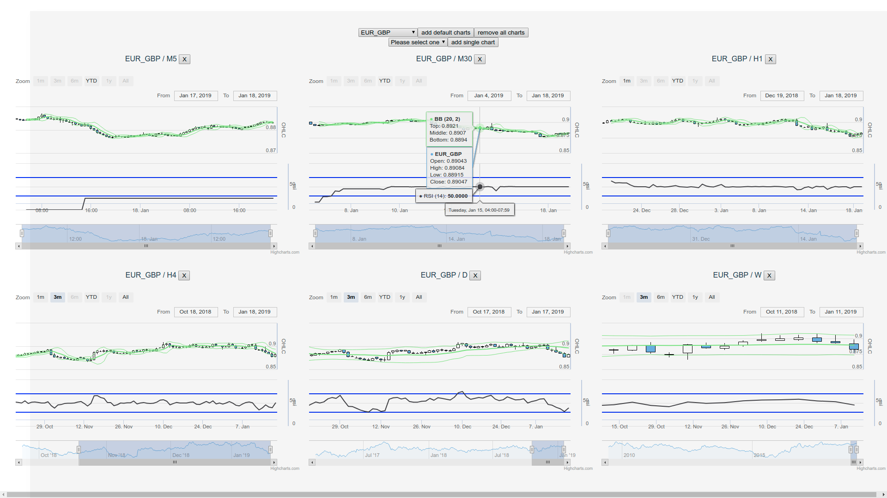

# forex-dash



## setup

create a .env file and fill it accordingly

```
VUE_APP_OANDA_ACCOUNT_NUMBER=
VUE_APP_OANDA_TOKEN=
```

## warning
Currently under heavy development, use at your own risk and only on paper trading account!

## Project setup
```
npm install
```
## Start with vue-ui

```
npm install -g vue-cli
vue ui
```
Then start the server with Tasks/serve